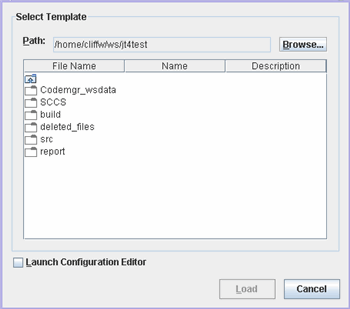

[]{#editingTemplate}

# Loading a Template {#loading-a-template .proc}

{longdesc="loadTemplate.html"} To load
a template, perform the following steps:

1.  Choose Configure \> Load Template from the Test Manager menu bar.

> The harness opens a Load Template dialog box containing a path field with Browse button and a
> navigation area that displays the file name, the template name (contained in the template), and
> the template description (contained in the template).
>
> The Path field sets the starting location for the directories and files displayed in the
> navigation area.
>
> The navigation area displays the directories and template files (if any) in the location set in
> the Path field. Only template files are displayed in the navigator area. Other files are hidden.

{longdesc="loadTemplate.html"}

2.  Use the icons in the dialog box to navigate to the location of the template.

> The Path text field in the dialog box displays the location for the list of files displayed in the
> dialog box.

3.  Click the template icon and the Load button.

> The harness loads the template. If the template is not correct for the test suite, the harness
> displays an error dialog box and closes without loading the template.

----------------------------------------------------------------------------------------------------

[Copyright](../copyright.html) © 2006, 2011, Oracle and/or its affiliates. All rights reserved.
